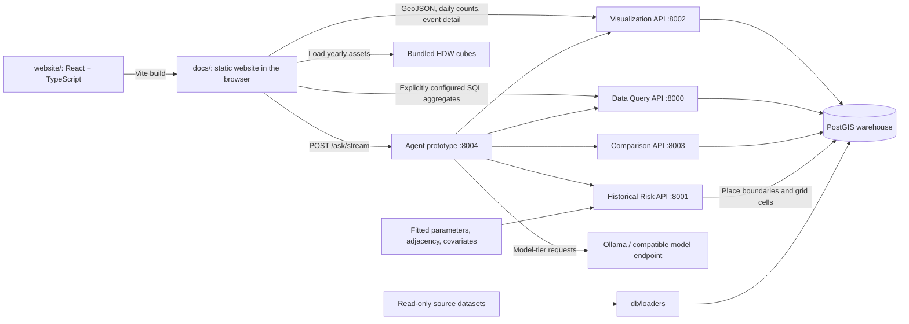

# Wildfire Platform

A wildfire research platform combining an interactive analysis website, a PostGIS event warehouse, modular FastAPI services, and a historical **cNHPP** (convolutional non-homogeneous Poisson process) ignition-risk model. The website supports recorded fire and outage exploration, weather playback, regional and seasonal analysis, and result exports.

The current website offers **13 analysis views in five panel categories**. Model scoring is a separate research capability: opening the website does not fit a model, start a GPU, or require a local database.

## Architecture



Maps and record tables request complete filtered records from the Visualization API. Grouped comparisons, summary metrics and regional series use those records by default; an explicitly configured Data Query URL enables geometry-free SQL aggregates. Calendar alignment and seasonal averages use the existing daily time-series buckets. HDW playback loads the supplied static weather cubes. The Agent API can additionally route questions to the Data Query, Comparison and Risk services and returns structured views alongside its answer.

The default website connects to the deployed APIs configured in [`website/src/api.ts`](website/src/api.ts). Local services are useful for backend development but are not prerequisites for previewing the built website. The agent remains a routing prototype; the website currently renders only the view contracts it can reproduce faithfully.

## Layout

```text
website/                        # production React/TypeScript source and Node tests
  src/panelViews.ts             # available analysis views and their default settings
  src/api.ts                    # browser-facing API URLs, pagination and SSE client
  scripts/build.mjs             # Vite build into docs/; cleans temporary output
docs/                           # built GitHub Pages entrypoint and static assets
demo/                           # independent Figma-derived UI design reference
frontend/                       # separate local Historical Map + Planning Tool
analysis/                       # data dictionary, audits and read-only inventory SQL
shared/                         # cross-service utilities (paths, db)
db/                             # PostGIS schema + loaders (map layers + risk grid)
tests/                          # live API verification suite
services/data_query/            # read API over warehouse tables
services/visualization/         # styled GeoJSON / time series / detail
services/comparison/            # cross-utility / region / period metrics
services/agent/                 # local-LLM routing feasibility harness
services/gpu_control/           # start/stop demo GPU (Ollama) on port 8005
services/risk_forecasting/
  models.py                     # HPP / NHPP / cNHPP (do not modify lightly)
  grid_data_prep.py             # grid data loaders (do not modify lightly)
  adjacency.py                  # rebuild W from grid_cells.csv
  fit_model.py                  # fit + persist xi/beta
  predictor.py                  # trailing-window scoring
  app.py                        # FastAPI service
  data/                         # local data (large files gitignored)
  artifacts/                    # committed cnhpp_params.npz; replaced by an intended fit
  legacy/                       # superseded circuit-level code (reference only)
```

## Quick start: current website

To preview the committed website, run this from the repository root:

```sh
python -B -m http.server 8770 --bind 127.0.0.1 --directory docs
```

Open **http://127.0.0.1:8770/**. This serves the built application; no npm installation is needed for this path. Recorded-event panels need network access to the deployed APIs, and the basemap loads separately from OpenStreetMap.

For frontend development, use **Node.js 24** and run:

```sh
cd website
npm ci
npm run dev
```

Open **http://127.0.0.1:8771/**. Validate and rebuild from `website/` with:

```sh
npm test
npm run build
```

The build updates `docs/index.html` and `docs/assets/workspace/`. Commit the website source and generated output together. Other static assets are retained, and temporary build files are removed automatically. See the [website guide](website/README.md) and [Pages guide](docs/README.md).

### Using the workspace

1. Click **Add panel**, choose a category, then select an analysis view. It opens with suitable defaults; additional copies can be created with **Duplicate**.
2. Set the data source and open **Filters** to choose the scope. Each panel keeps its own settings.
3. Use **Change view** in a Map, Time series or Comparison header to switch its analysis while keeping the panel position, custom name and filters.
4. Hover or focus a map event for its location context. Click to keep the bubble open, then choose **View details**. Clusters expand to their member events.
5. Expand a panel for more space. The expanded **X** or **Escape** returns to overview; the overview X removes the panel. Overview scrolling moves the page.
6. Use the header export menu for CSV or supported chart PNG downloads. Exports include the complete filtered result, including regions or rows outside the overview.

| Category | Current views |
|---|---|
| Map | Wildfire events, EPSS outage circuits, PSPS areas, Fire weather |
| Time series | Event trends, Year comparison, Regional trends, Seasonal profile |
| Comparison | County ranking, Utility comparison, Cause breakdown |
| Record table | Event records |
| Stat card | Summary metrics |

**Seasonal profile:** select one to five years inside Filters. A single year is a solid weekly-count line; multiple years have dashed individual lines and a thicker solid average. The collapsed filter shows the number of selected years. **Regional trends:** PG&E divisions share the same vertical scale, with all regions available in expanded view and exports.

Panel names, order and settings are saved in browser local storage. Chat messages and fetched records are not persisted. Ask uses the existing SSE agent endpoint; a model outage does not prevent direct use of the data panels.

### Data interpretation and current scope

The [database dictionary](analysis/database-dictionary.md) describes warehouse columns, cause definitions and available model artifacts; [db/schema.sql](db/schema.sql) is the schema reference. EPSS is PG&E-only, and its cause categories describe outages. CPUC and CAL FIRE records do not supply the same cause field. PSPS customer totals count customer-events, not distinct households.

The implemented views are a subset of the feature roadmap. Current rankings compare recorded counts, not modeled circuit risk or rates normalized by customers served. HDW playback is a supplied historical weather surface, not predicted ignition probability. Predicted risk surfaces, residual maps and model performance cards still require separate integration. Source date ranges reflect recorded events rather than verified collection completeness or last-scrape timestamps.

### Connecting the website to local APIs

Copy `website/.env.example` to `website/.env.local`, or set these public URLs
in the frontend build environment:

```dotenv
VITE_VISUALIZATION_URL=http://127.0.0.1:8002
VITE_AGENT_URL=http://127.0.0.1:8004
VITE_DATA_QUERY_URL=http://127.0.0.1:8000
```

Restart the development server or rebuild the website afterward. Without overrides,
the existing deployed URLs are used. The repository-root `.env` configures Python
services. The older `frontend/assets/js/api-config.js` belongs to the separate local UI.

**Aggregation rollout:** without `VITE_DATA_QUERY_URL`, comparison, summary and
regional panels retain the deployed Visualization API's complete-record path and
calculate their aggregates in the browser. To enable SQL aggregation, first deploy
`/grouped-counts`, `/summary` and `/regional-series`, verify their public routing,
CORS and warehouse totals, then set `VITE_DATA_QUERY_URL` and rebuild. A configured
service failure remains visible; it does not switch to browser calculations.
The proposed CloudFront `/api/data-query` prefix returned static-server 404s during
verification, and the existing origin did not expose these new endpoints. Do not
enable that URL until deployment is verified. See the [API guide](services/data_query/README.md).

## Local backend setup

Install the Python dependencies in a virtual environment:

```bash
python -m venv .venv
# Activate it: .venv\Scripts\Activate.ps1 (PowerShell) or source .venv/bin/activate (POSIX)
pip install -r requirements.txt
```

Create `.env` from [`.env.example`](.env.example) on first setup, then review its database and data-directory settings. On Windows, set these in each service terminal when needed:

```powershell
$env:PYTHONPATH = "."
$env:PYTHONIOENCODING = "utf-8"
```

Run each API in a separate terminal from the repository root. These are the local development ports:

| Component | Port | Role |
|---|---|---|
| Data Query | 8000 | Filtered warehouse records, spatial queries and rankings |
| Historical Risk | 8001 | Fitted historical place/date ignition scoring |
| Visualization | 8002 | GeoJSON layers, time series, territory and event detail |
| Comparison | 8003 | Backend utility, region and period comparisons |
| Agent | 8004 | Deterministic/model routing and SSE answers |
| GPU control (optional) | 8005 | Authenticated start/stop of the configured demo GPU |
| PostGIS | 5433 | Local database host port; container port is 5432 |

The current website's direct data panels need Visualization and its warehouse; SQL aggregation additionally requires the updated Data Query service. Ask uses Agent and the relevant downstream services. Historical scoring additionally requires the model input files described below.

### PostGIS warehouse (map layers + grid)

See [`db/README.md`](db/README.md). Docker Compose starts the database only, on host port **5433**. For a fresh local development warehouse, start it and wait for its health check before loading data:

```bash
docker compose up -d
# PowerShell: $env:PYTHONPATH = "."
python -m db.loaders
```

Source GeoJSON/CSV is read from the sibling `dataset_demo/assets/data` repo (read-only), or `DATASET_DEMO_DATA_DIR`. Large source files are not included in a fresh clone. Loaders truncate and repopulate their target tables, so verify the configured database before rerunning them. The local warehouse also needs the national source/extract if loading `us_ignitions`; see the database guide for its path and extraction command.

### Data query API

Read endpoints over the warehouse (`services/data_query/`):

```bash
# PowerShell: $env:PYTHONPATH = "."
uvicorn services.data_query.app:app --port 8000 --reload --app-dir .
```

- Docs: http://localhost:8000/docs  
- Examples: `/ignitions`, `/us-ignitions`, `/epss/outages`, `/psps/events`, `/calfire/incidents`, `/circuits`, `/hftd`, `/iou-territories`, `/spatial/point`, `/spatial/summary`, `/rank`  
- Common params: `utility`, `year`, `county`, `start_date`, `end_date`, `bbox`, `format=json|geojson`, `geometry=true|false`, `limit`, `offset`. CPUC `county` is inferred at load from lat/lon against Census TIGER California polygons (`wildfire.counties`). `/spatial/point` returns that county. Circuit IDs are TEXT 9-digit zero-padded — never numeric.  
- CAL FIRE defaults to `incident_type in (Wildfire, Fire)` (use `untyped` / `all`). Year-to-year CAL FIRE **count** comparisons are a map-feed artifact (2023→2024 listed 133→611; posting threshold dropped, median acres 70→43). That is not a 4.6× fire year — Redbook counts rose ~10%; warehouse acres still track Redbook ~95–97%. See [`analysis/calfire-2024-jump.md`](analysis/calfire-2024-jump.md).  
- `GET /rank` is single-dataset top-N (`group_by` county|utility|circuit); it rejects `us_ignitions` and EPSS-by-utility. Say “top N of M” and keep ties.  
- Verification: `python tests/report_results.py` runs the repository's Python test suite and writes a report. Live tests require a populated database, the corresponding APIs and risk input files; it is separate from the website's Node tests.

**Ignition counts — two definitions:** `utility=` filters use the CSV **attribute** tag; `/spatial/summary` uses **polygon containment**. For PGE 2024 these differ by 4 rows (inside territory but not tagged PGE). See `services/visualization/README.md`.

### Visualization API

Styled GeoJSON / time series / territory / detail for agents and UIs (`services/visualization/`):

```bash
uvicorn services.visualization.app:app --port 8002 --app-dir .
```

- Docs: http://localhost:8002/docs  
- `/map-layer` (EPSS = circuit **lines**; `us_ignitions` is red `#dc2626`, off-by-default in the UI), `/time-series`, `/utility-territory`, `/event-detail`

### Comparison API

```bash
uvicorn services.comparison.app:app --port 8003 --app-dir .
```

- Docs: http://localhost:8003/docs
- `/compare-utilities`, `/compare-regions`, `/compare-periods` — see [`services/comparison/README.md`](services/comparison/README.md)

### Agent prototype

Read-only single-exchange router over all four services:

```bash
uvicorn services.agent.app:app --port 8004 --app-dir .
```

The deterministic tier handles fully specified reads, maps, comparisons,
rankings, and risk lookups before invoking local Qwen3 through Ollama. Seven
grouped HTTP tools, strict validation, response-contract checks, bounded
retries, payload summarization, and deterministic caveat injection validate
tool responses and attach source qualifications.

Run the staged 4B baseline with:

```bash
python -m services.agent.eval.runner --models qwen3:4b --thinking off --modes prompt
```

See [`services/agent/README.md`](services/agent/README.md) and the explicit
[`services/agent/SECURITY.md`](services/agent/SECURITY.md) threat boundary.

The agent binds `:8004` even when Ollama is down. Deterministic routes
(counts, maps, rankings) keep working; model-tier questions return a clear
offline sentence (HTTP 200), not a 500. `/health` stays a cheap `/v1/models`
probe and does not warm the model. The website Ask panel uses SSE
`POST /ask/stream`; leave `POST /ask` unchanged for eval. Relative dates and
ranges like `2021 to 2025` / `August 2023 to September 2024` are resolved in
the harness, not by the model.

### GPU control (optional)

Deployment support for starting/stopping the configured demo GPU instance. The current React website does not call these controls.

```bash
uvicorn services.gpu_control.app:app --port 8005 --app-dir .
```

`POST /gpu/start` and `POST /gpu/stop` require `X-GPU-Control-Token`. Missing
`GPU_CONTROL_TOKEN` returns 503 so start is never open. Status is unauthenticated
and pollable. Concurrent `/gpu/start` is locked: in-progress starts (and any
state other than `stopped`/`error`) return current status and do not call
`StartInstances` again. Stopping EC2 does not remove its EBS storage. See
[`services/gpu_control/README.md`](services/gpu_control/README.md).

### Local Historical Map and Planning Tool

The older [`frontend/`](frontend/README.md) is a separate local application with Historical Map and Planning Tool tabs. The current Pages website is built from `website/` into `docs/`; it does not load the older page scripts.

```bash
# visualization :8002 (and other APIs as needed)
python frontend/serve.py
# Open http://127.0.0.1:8765/index.html
```

`serve.py` mounts sibling `dataset_demo` at `/dataset_demo/` so Planning Tool PNGs resolve. Do **not** run `python -m http.server` from `frontend/` — those plots 404. Local API URLs are in `frontend/assets/js/api-config.js`. Verification notes: [`frontend/VERIFICATION.md`](frontend/VERIFICATION.md).

US Ignitions (`wildfire.us_ignitions`) are an IRWIN/FireCastRL all-cause sample (33,457 positives; not a census; not for cNHPP). They are not directly comparable to CPUC or CAL FIRE. See [`docs/dataset-comparison-cpuc-calfire-us.md`](docs/dataset-comparison-cpuc-calfire-us.md).

## Historical risk model: inputs and operation

The committed fitted parameters do not include the full input dataset. Prediction also requires adjacency and weather/vegetation covariates. Missing fitted parameters or adjacency cause a degraded health response and unavailable predictions; the service does not fit automatically. Place local data under `services/risk_forecasting/data/`:

| File | Tracked? |
|------|----------|
| `grid_cells.csv` | yes |
| `circuit_midpoints.csv` | yes |
| `grid_weather_YYYY.csv` | no |
| `events_YYYY.csv` | no |
| `daily_gridded_CA_YYYY.nc` | no |
| `grid_W.pkl` | no (rebuilt by fit / adjacency) |

### Refit only when research work requires it

Refitting is not part of website setup. Default training years are **2020–2023**; **2024 is used to select xi by validation log-likelihood**, not as an independent final test set for that same fit. Review covariates and adjacency diagnostics with the model owner before fitting.

```bash
# from repo root
python -m services.risk_forecasting.adjacency   # rebuild W only
```

Adjacency sanity check after rebuild: **nnz ≈ 3922**, **avg neighbors ≈ 3.8**.

After reviewing those diagnostics, an intended refit is run with:

```bash
python -m services.risk_forecasting.fit_model
```

This rebuilds adjacency, fits the model and writes `services/risk_forecasting/artifacts/cnhpp_params.npz`.

### Run the historical risk API

```bash
uvicorn services.risk_forecasting.app:app --port 8001 --reload --app-dir .
```

- `GET /health`
- `GET /predict` — exactly one place: `cell_id` **or** `lat`+`lon` **or** `county` **or** `utility` (PGE/SCE/SDGE), plus required `date`
- Optional: `&lookback_days=30` (default **90**, overridable via `LOOKBACK_DAYS`)

The model outputs Poisson intensity λ. The primary `risk` field is **P(≥1 ignition)** for the requested place: `1 - exp(-sum(λ_i))` (independent cells; documented because cNHPP vs NHPP OOS ΔLL is a statistical tie). `expected_count` is `sum(λ)` so large territories that saturate near 1 stay interpretable. Single-cell `intensity` is λ; multi-cell responses include `mean_intensity`. Place cells come from warehouse polygons (`wildfire.grid_cells` ∩ counties / IOU territories). A batch wrapper scores all 824 cells in one forward pass.

Also returned: `local_percentile` (this place’s P(≥1) vs the same place on complete-window days in that calendar month, 2020–2025) and `statewide_percentile` (this place’s mean cell intensity vs all 824 cells on that date).

**Coverage:** the research input inventory extends through **2025-12-31**, but a local installation can score only dates and lookback windows covered by the files actually supplied. There is no live HRRR ingest or future-forecast path. Missing inputs and dates outside coverage return explicit errors. Dec 2–31, 2020 were dropped because of the corrupt HRRR export.

### Risk configuration

| Env var | Default | Purpose |
|---------|---------|---------|
| `RISK_FORECASTING_DATA_DIR` | `services/risk_forecasting/data` | Data root |
| `RISK_FORECASTING_ARTIFACTS_DIR` | `services/risk_forecasting/artifacts` | Params root |
| `TRAIN_YEARS` | `2020,2021,2022,2023` | Fit years |
| `VAL_YEAR` | `2024` | Validation year used for xi selection |
| `LOOKBACK_DAYS` | `90` | Trailing window for `/predict` |

## Known issues

### `grid_data_prep.load_year()` is broken

`load_year()` passes an integer `N` into `load_weather_for_year(..., grid_df)`, which expects a DataFrame. **Do not call `load_year()`.** The fit and predict wrappers call `load_weather_for_year` / `load_vegetation_for_year` directly instead. `prepare_multiyear()` also expects a single combined events CSV; this repo uses per-year `events_YYYY.csv` files, so the service layers concatenate those itself.

`models.py` and `grid_data_prep.py` are left unchanged on purpose; new code wraps them.

### Cell 461 vegetation is all-NaN

Grid cell `461` has all-NaN `NDVI` and `fm100` in every available vegetation NetCDF year. The fit/predict wrappers mean-fill those values from the training column means, so **predictions for cell 461 are not meaningfully data-driven on vegetation** (weather covariates still apply). Related: cells `71`, `439`, and `521` have all-NaN `fm100` only. Excluding those four cells from a refit does not materially change coefficients (they hold 0 train events).

### SPFH coefficient is a covariate-semantics issue

After fixing Dec 2020 weather, cNHPP still fits a **positive** SPFH coefficient. That is not a data bug: specific humidity is not a dryness measure (warm air holds more moisture). Train TMP–SPFH correlation is moderate (~0.31 overall, ~0.44 within-cell; summer slightly negative). The eventual fix is to replace SPFH with **VPD or RH**, consistent with the lab’s fire-weather work.

### fm100 is largely redundant with TMP

Train Pearson(TMP, fm100) ≈ **−0.64**. Once TMP is estimated correctly (β ≈ +0.55), fm100’s coefficient collapses toward zero (~−0.02) because temperature already carries the warm/dry seasonal signal. That shrink is collinearity, not NaN dilution or a loader bug.

### December 2020 weather in `grid_weather_2020.csv`

`California_HRRR_daily_2020_01.csv` has a mid-file column shift for 2020-12-02…12-31 (TMP holds SPFH-scale values; real Kelvin sits under `Total Cloud Cover`). No clean same-hour (01Z) replacement exists. Other hours (06/12/18Z) are clean but systematically colder by ~2–6 K vs 01Z in November (~0.3–0.7× daily TMP std), so they were **not** substituted.

**Resolution:** those 30 days are removed from `grid_weather_2020.csv` and excluded from training. `prep_hrrr_grid.py` now rejects any day whose median TMP is outside 200–330 K. Fit selects `xi` by **2024 validation** log-likelihood (`VAL_YEAR`, default 2024).

## HPP vs NHPP vs cNHPP (corrected data)

Leave-one-year-out on 2022/2023/2024 (train = other years in 2020–2024; Dec 2–31 2020 excluded). cNHPP ξ selected by train LL. Uncertainty on ΔLL = cNHPP − NHPP via day-blocked bootstrap (5000 resamples).

| Holdout | NHPP val LL | cNHPP val LL | ΔLL | Bootstrap SE | 95% CI | P(Δ≤0) |
|---------|-------------|--------------|-----|--------------|--------|--------|
| 2022 | −4246.0 | −4248.6 | **−2.6** | 7.9 | [−20.6, +9.8] | 0.58 |
| 2023 | −3419.9 | −3424.0 | **−4.2** | 10.7 | [−28.0, +11.2] | 0.61 |
| 2024 | −4877.6 | −4873.9 | **+3.7** | 5.6 | [−9.0, +12.3] | 0.24 |

**Verdict: tie.** ΔLL flips sign across years, every 95% CI covers 0, and \|ΔLL\| is ≪ SE (~0.1% of \|NHPP LL\|). Fixing Dec 2020 does not change the prior finding that spatial memory adds little on this 824-cell weather grid. Rerun: `python -m services.risk_forecasting.compare_models`.

## Scope

Historical dates only for years with local covariate files. No live HRRR ingestion in this service.
